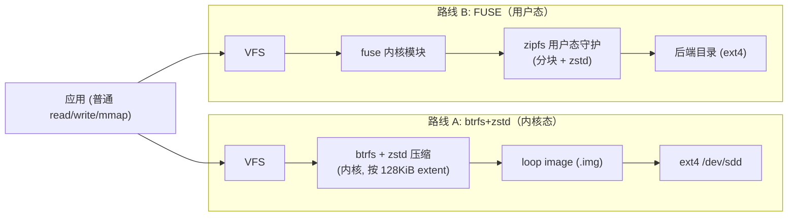

# zipfs 前期总纲：方案一（btrfs+zstd）对照方案四（FUSE 透明压缩）

> 文档性质：**前期范围与实验设计（intent + 方法）**，不是实现计划。回答「我们要比什么、怎么比、用什么判据」。实测环境另见 [environment-snapshot.md](./environment-snapshot.md)。
> 日期：2026-06-27。

## 1. 目标与背景

需求来源：希望在 WSL 里把某个原始目录以**透明压缩**方式存储——上层是普通 POSIX 读写接口，底层自动压缩/解压，从而省盘且不改变使用方式。

本项目 `zipfs` 要做的，是**横向评测两种实现路线**，据此决定后续投入哪条：

- **方案一 / 路线 A —— 内核态 btrfs + zstd（loop image）**：成熟、内核速度，作为**参照基线（reference baseline）**。
- **方案四 / 路线 B —— 用户态 FUSE 透明压缩（Rust，复用成熟积木）**：可控、可移植。语言定为 **Rust**；优先**复用现成成熟库/实现**而非从零造轮子。

最终交付：一份有数据支撑的对照报告 + 一个明确的「该不该自研 FUSE、自研要避开哪些坑、各路线分别适合什么场景」的结论。

> **已确认决策（2026-06-27）**，详见 §9：
> 1. 路线 B 用 **Rust**，优先复用现成成熟库/实现。
> 2. 负载**读写并重** → **排除 SquashFS / DwarFS 等只读方案**（仅作压缩比与分块设计的参考，不进正式对比）。
> 3. **压缩比 / 吞吐 / 随机写延迟三判据并重**，不预设高低；目标是**找出每条路线适合的场景**，而非选单一冠军。

## 2. 两条路线的本质差异



| 维度 | A: btrfs+zstd | B: FUSE |
|---|---|---|
| 运行位置 | 内核态 | 用户态守护 + 内核 fuse 转发 |
| 权限 | 需 root 挂 loop | 仅需 `/dev/fuse`，普通用户可挂 |
| 成熟度 | 高（含快照/校验和） | 取决于实现；自研需自负正确性 |
| 压缩粒度 | extent（≤128KiB），自带「不可压缩则跳过」启发式 | 由实现决定（自定义分块大小 / 字典） |
| 随机读写 | 内核原生支持 | **难点**：需分块 + 索引 + 写时读改写 |
| mmap | 原生 | 实现复杂，常受限 |
| 可控性 | 低（受内核策略约束） | 高（压缩策略、分块、字典完全自定） |
| 主要开销 | 压缩 CPU | 压缩 CPU + **FUSE 上下文切换/拷贝税** |
| 适用面 | Linux 原生目录 | Linux 原生目录，也可挂在 `/mnt/c` 等之上 |

## 3. 路线 B 的核心设计张力：随机访问

这是 FUSE 透明压缩成败的关键，必须在评测中正面对待：

压缩是**流/块导向**的，而 POSIX 要求在任意偏移随机读写。因此一个可读写的 FUSE 压缩文件系统通常要：

1. 把每个逻辑文件切成**固定大小逻辑块**（如 64KiB / 128KiB）；
2. 各块**独立压缩**（可选共享字典提升小块压缩比）；
3. 维护「逻辑偏移 → 物理压缩块位置/长度」的**索引**；
4. 随机写 = 命中块的**读改写（read-modify-write）**：解压整块 → 改 → 重压 → 落盘 → 更新索引。

块大小是核心权衡：**块越大压缩比越高，但随机写放大越严重；块越小随机写越友好，但压缩比和索引开销变差**。这一项直接决定 B 在随机写负载下的表现，是评测要刻意覆盖的变量。

> 只读方案（SquashFS、DwarFS）靠绕开第 3、4 步换取极高压缩比；但本项目是**读写负载**，故它们被排除在正式对比之外，仅作压缩比上限与分块/去重设计的参考。
>
> 一个直接的反例对照：现成 Rust 项目 `fuse-zstd` 采用**整文件单 zstd 流**（无分块），它在随机写下的劣化恰好能实证「为什么读写场景必须分块」——所以把它纳入基准当对照，而非候选解。

## 4. 评测方法

### 4.1 三个对照条件（含控制组）

不要只比 A vs B。加一个**无压缩 ext4** 作为吞吐地板，才能把「FUSE 税」和「压缩税」分别看清：

| 代号 | 条件 | 角色 |
|---|---|---|
| C0 | 裸 ext4（无压缩，直接在 `/dev/sdd` 上） | 原始吞吐地板（control） |
| A  | btrfs + zstd:{1,3,9,15}（loop image） | 内核态参照基线 |
| B0 | FUSE **透传**（passthrough，不压缩，基于 `fuser`） | **隔离纯 FUSE 开销** |
| BV | zipfs 自研，**布局 V（容器/虚拟盘）** | 自研对照项之一，详见 [01-zipfs-design.md](./01-zipfs-design.md) |
| BS | zipfs 自研，**布局 S（影子树/每文件压缩包）** | 自研对照项之二 |
| B2 | FUSE + zstd（**整文件**，`fuse-zstd`） | 消融参照：BS vs B2 = 分块 vs 整文件 |

> B0 是方法上的关键招：先量「FUSE 本身的税」（B0 − C0），再量「在 FUSE 上加压缩的增量」（BV/BS − B0）。**BV vs BS 是本项目核心实验**（主变量为磁盘布局，但一致性语义 / dedup / 元数据代价等伴生变量不可消除，须分别归因——见 [01-zipfs-design.md](./01-zipfs-design.md) §2）。压缩算法首版 **zstd 多等级 + lz4（`lz4_flex`）速度对照**；**仅 Linux/WSL 原生目录，不覆盖 `/mnt/c`**。

### 4.2 指标

- **压缩比**：逻辑大小 / 物理占用（A 用 `compsize`；B 用后端目录实际 `du`）。
- **吞吐**：顺序写、顺序读、随机读（4K/64K）、随机写（4K/64K）。
- **延迟分布**：p50 / p99（用 fio 输出）。
- **CPU 成本**：每 MB 的 user+sys 时间。
- **内存 / page cache 行为**：守护 RSS、缓存占用。
- **mmap 正确性与性能**（B 重点核查）。
- **元数据吞吐**：大量小文件 create/stat/unlink。
- **崩溃一致性**（定性）：守护被 kill / 断电模拟后的数据状态。

### 4.3 工具

- **fio** 为主（标准、可复现、能出 p99）。job 文件入库 `bench/fio/`。
- 真实负载补充：解包 Linux 源码树 → `grep -r` → 增量 `git status`；可选 `git clone` 大仓。
- 每轮之间冷/热缓存都测；冷缓存前 `sync && echo 3 | sudo tee /proc/sys/vm/drop_caches`。

### 4.4 数据集（按可压缩性分层）

| 数据集 | 特征 | 考察点 |
|---|---|---|
| **★ `~/.claude/projects` 副本（旗舰真实负载）** | 8.7GB，jsonl/txt/json，**31x 可压缩**，双峰大小，追加写为主，跨会话高冗余 | 项目最终目标负载；append 路径、巨文件分块、去重潜力、综合表现（见 [01-zipfs-design.md](./01-zipfs-design.md) §1.1） |
| 文本/源码（Linux 源码树、JSON dump、日志） | 高可压缩 | 压缩比上限、压缩 CPU |
| 类家目录混合树 | 混合 | 真实场景综合表现 |
| 预压缩媒体（jpg/mp4/.zst） | 近乎不可压缩 | 启发式跳过是否生效、无谓开销 |
| 海量小文件 vs 少量大文件 | 元数据 vs 数据 | 索引/元数据开销、放大效应 |

### 4.5 受控变量

同一后端磁盘（ext4 `/dev/sdd`）、同一数据集、同一 image 容量上限、zstd 等级做**扫描**（A: 1/3/9/15；B: 与之对齐，注意 zstd 库本身可到 19/22 但 btrfs 上限 15，比较时取交集或分别标注）、并发度（fio `numjobs` 1 与 N）、冷/热缓存分别记录。每个点重复 ≥3 次取中位数。

### 4.6 如何下结论：场景适配而非单一冠军

三判据（压缩比 / 吞吐 / 随机写延迟）**并重、不预设高低**。结论的形态不是「A 还是 B 赢」，而是一张**场景 → 推荐路线**的映射表，例如：

| 典型场景 | 主导判据 | 预期适配（待数据验证） |
|---|---|---|
| 冷归档、写少读多、可压缩文本 | 压缩比 | 高块大小；整文件模型亦可接受 |
| 活跃读写、随机小写频繁 | 随机写延迟 | 小/中块分块；FUSE 整文件出局 |
| 顺序大吞吐（备份/拷贝） | 吞吐 | 内核态 A 优势区，B 的 FUSE 税最吃亏 |
| 不可压缩媒体为主 | 吞吐 + 不劣化 | 启发式跳过是否生效是关键 |

每条结论必须落到**具体数据点**（块大小 × zstd 等级 × 访问模式），避免「看情况」式空话。这张表是最终报告的主交付物。

## 5. 首轮最小实验（先打通，再铺开）

1. 装依赖（见环境快照「一键补齐」）。
2. 写 `bench/scripts/`：`setup-btrfs.sh`（建/挂 loop image）、`run-fio.sh`、`collect.sh`（解析 fio JSON → CSV）。
3. 准备 1 个高可压缩 + 1 个不可压缩数据集，各一份。
4. 跑 **C0 / A(zstd:3) / B0 / B2** 四条，单负载：顺序写 + 随机读 + 随机写。
   - 目的：确认 loop+btrfs 能挂、`fuser` 透传能挂、`fuse-zstd` 能挂、fio 流程通；拿到「FUSE 税」（B0−C0）与「整文件模型随机写劣化」（B2）的初值。
5. 看初值确定 B1 分块实现的形态（基于 `sqlitefs` 参考 vs 从 `fuser` 积木自建），再进入全面矩阵。

## 6. 路线 B 的候选实现（Rust，实测调研 2026-06-27）

**核心现实**：Rust 生态里**没有生产级、成熟的读写透明压缩 FUSE 成品**。成熟的是**积木**（绑定 + 压缩 crate），整文件系统级项目均为实验/参考质量。因此「复用成熟实现」= 以成熟积木为地基 + 把现有项目当参考/对照。

### 6.1 成熟积木（地基，直接用）

| 组件 | crate | 说明 |
|---|---|---|
| FUSE 绑定 | **`fuser`** | Rust 事实标准（`fuse-zstd` 即用 `fuser 0.15`）；low-level，需自己实现 inode/读写语义 |
| 异步 FUSE 绑定 | `fuse3` | 若想 async 运行时可评估 |
| 压缩 | **`zstd`**（0.13）、`lz4_flex` | 与 §4 等级/算法扫描对齐 |

### 6.2 现有整文件系统项目（参考 / 对照，非成品）

| 项目 | 语言 | 架构 | 读写/随机 | 压缩 | 成熟度 | 在本项目中的角色 |
|---|---|---|---|---|---|---|
| `Big-Dig-Data/fuse-zstd` | Rust(`fuser`) | **整文件单 zstd 流**，xattr 存原始大小 | 随机写弱 | zstd | 小而活跃(~13★) | **B2 反例对照**，非候选解 |
| `oldshensheep/sqlitefs` | Rust | **定长分块** + 快照 + 全局去重，SQLite 后端 | 读写、分块 | none/lz4/zstd + 等级 | 实验：作者自述「99% AI 生成、review~20%、每写 COW sync 性能差」 | **B1 首选参考**：架构对路，借鉴分块/索引设计 |
| `sbstp/nightshift` | Rust | SQLite 后端 + SQLCipher 加密 | 读写 | lz4/zstd | 早期 0.3.0「hackable」 | B1 备选参考；DB 后端开销值得单独量 |
| `Norost/nrfs` | Rust | 自研 FS：压缩 + CoW + 校验 | 读写 | 有 | 雄心型，成熟度待核 | 设计参考 |

### 6.3 仅作压缩比 / 设计参考（只读，排除出对比）

| 项目 | 说明 |
|---|---|
| `mhx/dwarfs` (C++) | 高压缩比只读 FS（去重 + 块压缩），压缩比天花板的参考标尺 |
| SquashFS / `squashfuse` | 只读，本项目读写需求下不进对比 |
| `ratarmount` (Python) | 透明挂归档，读为主 |

> 路线决策建议（待首轮数据确认）：**B0 透传基线 + B1 基于 `fuser`/`zstd` 的分块实现（借鉴 `sqlitefs` 的分块/索引，但去掉 SQLite 后端的额外开销，或单测其开销）+ B2 `fuse-zstd` 整文件对照**。即「复用成熟积木 + 借鉴现有分块设计」，而非直接拿某个实验项目当生产解。

## 7. WSL 特有注意事项

- **btrfs 模块**：每次 WSL 启动需 `sudo modprobe btrfs`（模块在内核里，仅未自动加载）。要持久化，走启动脚本或 `/etc/wsl.conf` 的 `[boot] command`。
- **逻辑 vs 物理空间**：压缩省的是 image 内**逻辑数据量**；WSL 的根 `ext4.vhdx` 删除后不自动收缩，物理回收要 `wsl --shutdown` 后在 Windows 侧 `Optimize-VHD` / `diskpart`。评测谈「省了多少盘」时要分清这两层。
- **不要在 `/mnt/c` 上做主基准**：Windows 侧经 9p/drvfs，慢且不代表 Linux 原生表现。所有主基准放在 Linux 原生 ext4 后端；「FUSE 挂 `/mnt/c`」是另一个独立用例，单列。
- **drop_caches / modprobe / mount 需 root**：WSL 默认可 sudo，无碍。
- 资源充足（20 核 / 196GB），但**基准一次只跑一个**，避免相互干扰；fio 用自带计时。

## 8. 建议的仓库结构

```text
zipfs/
├── docs/
│   ├── 00-overview.md            # 本文（实验总纲）
│   └── environment-snapshot.md   # 实测环境
├── bench/
│   ├── scripts/                  # probe-env.sh setup-btrfs.sh run-fio.sh collect.sh
│   ├── fio/                      # fio job 文件
│   ├── datasets/                 # 数据集生成/获取脚本（大数据本身 gitignore）
│   └── results/                  # 原始 + 解析结果，按日期归档
└── fuse/                         # 路线 B 的 Rust 实现：fuser + zstd 积木，B0 透传 / B1 分块
```

## 9. 决策记录

### 已定（2026-06-27）

1. **路线 B 形态**：用 **Rust 自研**（无成熟成品，见 §6），以成熟积木 `fuser` + `zstd`/`lz4_flex`（+ 可选 `redb`/`rusqlite`）为地基。两种磁盘布局都做：**布局 V（容器/虚拟盘）** 与 **布局 S（影子树/每文件压缩包）**，详见 [01-zipfs-design.md](./01-zipfs-design.md)。
2. **目标负载**：**读写并重** → SquashFS / DwarFS 等只读方案**排除**出正式对比，仅作参考。
3. **判据**：压缩比 / 吞吐 / 随机写延迟**三者并重**，不预设高低；结论形态是**场景适配映射表**（见 §4.6），非单一冠军。
4. **压缩算法**：zstd 多等级 + **lz4（`lz4_flex`）速度/比值对照**，纳入。
5. **目标位置**：**仅 Linux/WSL 原生目录，不覆盖 Windows `/mnt/c`**。

### 仍开放（可在首轮数据后再定）

1. **布局 V 容器后端**：`redb`（纯 Rust/ACID，倾向）还是 `rusqlite`（对标 `sqlitefs`）？见设计文档 §13。
2. **布局 V 全局去重**：首版即做（内容寻址），还是先简化、留作 V 专属增强再测？
3. **mmap 写支持**优先级（默认后置）。

## 10. 下一步

待第 9 节决策点明确后，把「首轮最小实验」展开为可执行的 `bench/scripts/`，并按 TDD/脚本可复现的方式落地——届时另起 plan 文档。本文只锁定**比什么、怎么比、判据是什么**。
