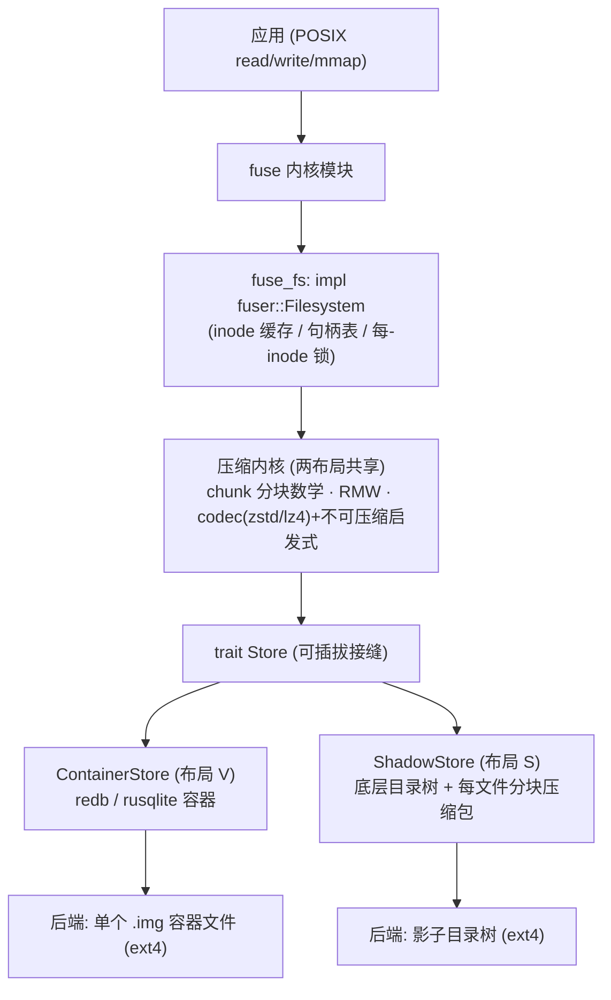

# zipfs 实现设计：自研 Rust FUSE 透明压缩文件系统（两种磁盘布局）

> 文档性质：**实现设计（how）**。意图与对照框架见 [00-overview.md](./00-overview.md)，实测环境见 [environment-snapshot.md](./environment-snapshot.md)。
> 日期：2026-06-27。状态：设计草案，待 architect 审查 + 首轮验证。

## 1. 决策与范围

Rust 无成熟读写透明压缩 FUSE 成品（见 overview §6），故**自研**，以成熟积木为地基：`fuser`（FUSE 绑定）+ `zstd` / `lz4_flex`（压缩）+ 可选 `redb`/`rusqlite`（容器后端）。

核心要对比**两种磁盘布局**，二者共享同一压缩内核，仅「块与元数据的存放方式」不同：

- **布局 V（Vdisk / 容器）**：整个挂载点的数据 + 元数据落进**一个容器文件**（虚拟盘）。
- **布局 S（Shadow / 影子树）**：**每个逻辑文件 → 底层 FS 上一个分块压缩包**；目录结构用底层 FS 的真实目录。

两者都要做、都要测。

### 1.1 目标工作负载（驱动设计，实测 2026-06-27）

最终目标之一：用 zipfs 承载 **`~/.claude/projects`** 的会话 transcript。**目标数据范围已正式分层界定**（见 [03-target-data-scope.md](./03-target-data-scope.md)）：**首要 = `projects/*.jsonl` + append 日志**（8 GB 的 append-only 可压缩核心）；**后续 = `file-history`**（524 MB）；**排除 = plugins（1.8 GB 可重装代码）与已压缩媒体（`.pack/.png/.pdf`）**。实测画像（针对首要目标）：

| 维度 | 实测 | 对设计的影响 |
|---|---|---|
| 规模 | 8.7 GB / 8132 文件 / 474 目录 | 中等规模，单机可行 |
| 类型 | 主为 `.jsonl`(2155)/`.txt`(4061)/`.json`(1885) | 文本，高可压缩 |
| 压缩比 | 单 838MB jsonl 实测 **zstd:3 → 31.3x** | 压缩收益被坐实，压缩是主线 |
| 大小分布 | **双峰**：29% <64KB 海量小文件 + 顶部 838/300MB+ 巨型 jsonl | 小文件打包（利 V）与巨文件分块/追加（两布局都要扛） |
| 写模式 | **追加写为主**（transcript append 增长） | 见下，**最关键** |
| 冗余 | **主为文件内长程自重复**（每轮重发系统提示/CLAUDE.md/schema、重读同文件、历史逐行累积；单 transcript 自身即 ~20x）；跨文件重复**定长块 0% 命中**、同目录拼接增益仅 1.0x | 最便宜杠杆是**放大压缩窗口/长程匹配**（zstd `--long`/更大块），非去重；跨文件去重价值存疑，须 CDC 实测裁定 |
| 活跃度 | Claude Code **运行时实时写入** | 守护稳健性 + 崩溃一致性 + 启动自挂载升为一等需求 |

**由此引出的硬约束**：

1. **append 不得触发整文件重写**：追加只脏尾块。布局 S 的 archive 格式必须**索引在尾部 / 可追加 chunk 表**，否则对 838MB 文件每次 append 重写全文 = 灾难（见 §7）。此项从「后续优化」升级为**目标负载硬需求**。
2. **随机写中间块在本负载下罕见** → 之前对 RMW 随机写放大的担忧，对此负载缓解；首要优化对象是 **append 路径**而非任意 offset 随机写。
3. **去重价值待验证，不预设友好**：实测跨文件冗余定长块 0% 命中、同目录拼接增益仅 1.0x，冗余主要在**文件内**；「V+dedup 叠加在 31x 之上」是被实测推翻的旧假设。dedup 是否进主线由 G3 据 **CDC 命中率实测**裁定，非默认收益。逼近单流上限的更高 ROI 杠杆是编码侧 zstd `--long`/更大窗口（见 ROADMAP T3）。
4. **可靠性**：losing 会话日志不可接受 → 崩溃一致性、daemon 健壮、WSL `[boot]` 自挂载列入需求，不只是基准跑分。
5. **旗舰基准数据集**：取 `~/.claude/projects` 副本作 overview §4.4 的真实数据集。

## 2. 分层架构



**关键设计原则**：分块/压缩/codec 全在 Core；`Store` 负责「变长 blob 的放置 + 命名空间 + 空闲管理 + 该后端的持久化原语」。

> **诚实校正（architect 审查 2026-06-27）**：BV vs BS **不是严格单变量实验**。「块放哪」是主变量，但有几个**无法消除的伴生变量**，报告必须对每个分别归因，不能笼统说「布局差异」：
> 1. **一致性语义**：V 继承容器 ACID，S 是 temp+rename（且跨目录 rename 非原子）——durability 强度不同，性能数字含此项（见 §10、C1）。
> 2. **去重可用性**：内容寻址去重只有 V 能做，开启后 Core 调用路径分叉；故 dedup 是 **V 专属**，跑分单列「V+dedup」，不与 BS 混比（见 §6、§13）。
> 3. **空闲空间策略**：S 的包内空闲位 / V 的容器 GC 都在 Store 内，Core 不感知「一次 `put_block` 是 O(chunk) 原地写还是 O(filesize) 重写」。
> 4. **元数据访问代价 / 内核缓存**：见 §7、§9 受控配置。
>
> 为最大化可比性：两 Store 共用**同一条 durability 契约**（仅 `fsync` 落盘，平时允许丢），由 Core 决定何时调 `Store::fsync`/`sync_all`（见 §5 接口）。

## 3. 共享内核：分块 + 压缩 + 索引

- 逻辑文件 = 定长**逻辑块**序列，`CHUNK_SIZE`（**默认 64KiB**——microbench 实测 256KiB 会让 redb 容器膨胀 2.75x，见 §6.1；基准仍扫 16/64/256KiB，但 256KiB 档须配非-redb 数据区或接受膨胀）。
- 每块**独立压缩**（zstd 等级 / lz4 可选），记录压缩后长度。
- **随机读** `[off, off+len)`：定位覆盖的块 → 解压 → 切片返回。
- **随机写** `[off, ...)`：命中块**读改写（RMW）**——解压整块 → 打补丁 → 重压 → 写回 → 更新索引与文件大小。部分块（首尾）按 RMW 处理，整块覆盖可跳过读。
- **每文件索引**：`chunk_idx → (物理位置, 压缩长度, flags)`；`flags` 含「原样存储（不可压缩）」「空洞/稀疏」。
- **不可压缩启发式**：若 `clen >= raw * 阈值`（如 0.95）则原样存 + 置 flag，省解压成本并避免膨胀（对齐 btrfs 行为）。

> 块大小是核心权衡：大块 → 高压缩比但随机写放大重；小块 → 随机写友好但压缩比/索引开销差。这条贯穿两布局，是首要基准维度。

## 4. FUSE 层（`fuser`）

实现 `fuser::Filesystem`：`lookup / getattr / setattr / read / write / create / mkdir / unlink / rmdir / rename / readdir / open / release / flush / fsync / truncate / statfs`（`xattr` 视需要）。

- inode 分配 + 内存 inode/attr 缓存；打开文件句柄表。
- **并发与锁顺序**：`fuser` 多线程派发；单文件 RMW 用**每-inode 锁**。跨 inode 操作（`rename`/`link`/`unlink` 含父目录 inode）必须按**全局锁顺序**（按 ino 升序）或走单独元数据锁，避免死锁与目录项竞态。
- **lookup-count / forget 与延迟回收**：维护内核侧 lookup 引用计数；`unlink` 一个仍被打开或仍被内核引用的 inode **不能立即回收 blob**（POSIX 要求最后一个 fd 关闭前可继续读写）——置 orphan、待 `forget` + 句柄全关再回收。P4 必测。
- mmap：首版可不支持或仅只读 mmap；写时 mmap 复杂度高，且与 `direct_io` 互斥（见 §4.1），列为后续。

### 4.1 FUSE 写模型与配置（随机写正确性 + 可比性的地基，BV/BS 必须一致）

随机写 FUSE 最易出 bug 与最影响跑分的地方，必须先锁定，且两 Store 取值一致，否则又是隐藏变量：

- **writeback cache（`FUSE_WRITEBACK_CACHE`）vs `direct_io`**：二者互斥。`direct_io` 语义简单（write 直达、offset/size 精确）、延迟高；writeback 由内核缓冲 dirty 页、合并下发，但内核维护 size 会与 header 的 `uncompressed_size` 打架。**首版选 `direct_io`** 求正确，writeback 作为后续优化项单测。
- **`max_write`**：内核把大 write 拆成 ≤ `max_write`（常见 128KiB）的片。若 `CHUNK_SIZE > max_write`，一次逻辑块写被拆成多次 `write` 回调 → 每次触发 RMW，**随机写放大被二次放大**。基准里 `CHUNK_SIZE` 与 `max_write` 的交互要显式记录，别把 CHUNK_SIZE 当纯压缩权衡。
- **越界 / 空洞 / 非块对齐写**：RMW 首尾块先 `get_block` 解压再 patch；若块不存在（写稀疏空洞、或越过 EOF）按**零填充**处理，而非把 `None` 当错误。空洞与 RMW 的交互是 P3 必踩点。
- **挂载选项作为受控常量**：`attr_timeout`、`entry_timeout`、`direct_io`、`max_write` 在 BV/BS 间固定取同值，写进 §9 基准配置并在报告声明。

## 5. `Store` 接缝（可插拔的唯一差异面）

```rust
// 伪代码：Store 只管「不透明已压缩块 + 命名空间 + 属性」，不碰压缩
trait Store {
    // 命名空间 / 元数据
    fn lookup(&self, parent: Ino, name: &str) -> Option<Attr>;
    fn create(&self, parent: Ino, name: &str, attr: Attr) -> Ino;
    fn mkdir(&self, parent: Ino, name: &str, attr: Attr) -> Ino;
    fn unlink(&self, parent: Ino, name: &str);
    fn rmdir(&self, parent: Ino, name: &str);
    fn rename(&self, old: (Ino, &str), new: (Ino, &str));
    fn readdir(&self, dir: Ino) -> Vec<DirEntry>;
    fn setattr(&self, ino: Ino, attr: Attr);
    // 数据：StoredBlock = 已压缩字节 + flags（压缩在 Core 完成）
    fn get_block(&self, ino: Ino, idx: u64) -> Option<StoredBlock>;
    fn put_block(&self, ino: Ino, idx: u64, blk: StoredBlock);
    fn truncate_blocks(&self, ino: Ino, keep_from: u64); // 截断丢弃多余块
    fn fsync(&self, ino: Ino);   // 单文件持久化（POSIX fsync 语义）
    fn sync_all(&self);          // 全局 barrier
}
```

> `fsync(ino)` 与 `sync_all()` 分开：POSIX `fsync(fd)` 只保证单文件落盘，若 Store 只有无参 `sync()`，V 会被迫全库 commit，单文件 fsync 跑分虚高、不可比。Core 据 FUSE `fsync` 回调决定调哪个。
>
> **去重不在共享路径**：内容寻址去重要求 key=`hash(blob)` + 引用计数，会改变 `put_block`/`truncate_blocks`/`unlink` 语义且**仅 V 可行**。故 dedup 作为 `ContainerStore` 的可选增强，开启时跑分单列「V+dedup」，不与 BS 同列比较。

## 6. 布局 V —— 单容器 / 虚拟盘

### 6.0 为什么需要容器（它不只是元数据）

V 的定义性特征是「整棵树落到一个后端对象」，这把三件事逼进同一个文件：

| 职责 | 体量/难度 | 内容 |
|---|---|---|
| 命名空间/元数据 | 小、易 | inode 表、目录项、每文件 chunk 索引、属性 |
| **数据块存储** | **体量主体** | 变长压缩 chunk 的 blob 仓 |
| **空闲空间管理 + 崩溃一致性** | **真正重的部分** | chunk 随 RMW/删除变长 → 碎片、分配、回收；原子更新 |

容器**不是「为存元数据」**——元数据是最轻的一块。真正负担是「**变长 blob 分配器 + 空闲管理 + 事务**」。`redb`/SQLite 本质即「带 ACID 的 B-tree 分配器」，白送分配 + 事务 + 崩溃一致，故首选复用而非手搓。

### 6.1 三档形态（默认 redb 全包，自写虚拟盘 gated on microbench）

| 形态 | 元数据 | 数据块 | 何时选 |
|---|---|---|---|
| **redb 全包（首版默认）** | redb 表 | redb blob `key=(ino,idx)` | 起步，最简；表 `inodes`/`dirents`/`blocks` |
| redb 元数据 + 自写数据区 | redb | 自写 extent 分配器（「专门虚拟盘」数据区） | redb 大 BLOB microbench 不达标时 |
| 全自写虚拟盘 | 自写 inode 表 | 自写 extent | 仅当需 btrfs 给不了的压缩 extent 语义、且愿付成本 |
| `rusqlite`（备选） | SQLite 表 | BLOB | 想直接对标 `sqlitefs`；大 BLOB 溢出页有开销 |

> **「专门虚拟盘」的隐患**：手写 superblock + bitmap/extent + inode 表 = 写迷你文件系统，控制力最强但易滑向「一个更差的 btrfs」（重造其变长 extent 分配却不如它成熟）。**默认不先做**，以 §6.1 末「大 BLOB 随机更新 microbench」为闸门。

> **闸门已跑（microbench 实测 2026-06-27，redb 4.1 vs sqlite，详见 `microbench/REPORT.md`）**：
> - **吞吐够用**：redb 批量事务比每块一事务快 **8–18x**；首版选 **redb 全包**，无需为性能自写数据区。
> - **写批处理是必备项**（非优化）：一次 `write` 回调内多块合并一事务、`fsync`/`flush` 才 commit——否则重蹈 `sqlitefs`「每写 COW sync」覆辙。
> - **空间是红灯且与块大小强相关**：redb 大 BLOB 膨胀——**256KiB 块 → 稳态 2.75x / compact 后 1.48x**；**64KiB 块 → compact 后 1.34x**。sqlite 几乎零浪费(1.01x) 但吞吐低一截。
> - **裁决**：redb 全包 + **默认 64KiB 块** + 写批处理。**不要默认 256KiB**——它触发第二档（redb 元数据 + sqlite/自写数据区）评估，不应死守 redb 全包。sqlite 作为「空间敏感」备选保留。

- **优点**：小文件天然打包（省 inode/最小块浪费）；易做**全局去重**（块按内容哈希做 key）；事务化。
- **缺点**：单点损坏波及全盘；并发受容器实现上限约束；KV/SQL 存大 BLOB 有额外开销；底层 FS 看到的是不透明 blob，无法绕过挂载直接访问文件。
- **写批处理（关键，避免重蹈 `sqlitefs` 覆辙）**：`sqlitefs` 作者自述「每写 COW sync 性能差」正是**每块一事务**的陷阱——事务开销 dominate，测出的是事务成本而非布局特性。对策：一次 `write` 回调内的多块更新合并到**一个事务**，仅在 `fsync`/`flush` 时 commit。`CHUNK_SIZE=256KiB` 时单 value 上百 KiB 会撑大 B-tree 页、触发 CoW 页分裂——**进设计前先对 redb/rusqlite 跑「大 BLOB 随机更新 microbench」**再定后端（§13 开放项1）。

## 7. 布局 S —— 影子树 / 每文件压缩包

底层目录树**镜像**逻辑树：逻辑 `/a/b.txt` → 后端 `BACKING/a/b.txt`，该后端文件是一个**分块压缩包**（不是单 zstd 流——那正是 `fuse-zstd` 随机写弱的根因）。**索引置于尾部（footer），使追加只需在文件末尾增量写**（见 §1.1 追加写硬约束）：

```text
[magic|version]
[compressed chunk 0][compressed chunk 1]...[compressed chunk N]
[chunk_index: (offset, clen, flags) × chunk_count]   ← footer
[footer: chunk_size|uncompressed_size|chunk_count|index_offset|crc]
```

- **追加路径（本负载主路径）**：尾块若满则在末尾**追加新压缩块**，重写尾部 footer（小）；尾块未满则只 RMW 尾块 + 重写 footer。**不触碰前部数据**，对 838MB 文件追加仅写增量。
- 文件尾部 footer 含 `index_offset`，打开时先读尾部定位索引，O(1) 找到 index，无需扫全文。

- **目录** = 底层真实目录。**属性来源**：mode/uid/gid/mtime **直接复用底层 inode 的 stat**，仅 `uncompressed_size` 与 `chunk_size` 放 **xattr（`user.zipfs.*`）或包头**。避免「为读属性而 open+解析每个 header」——否则 `ls -l`/`find` 在海量小文件下退化成 N 次 open，会让 BS 的元数据跑分不必要地难看（注意 ext4 xattr 大小限制，且 WSL 需确认 user xattr 已启用）。
- **名字映射**：逻辑 `/a/b.txt` ↔ 后端 `BACKING/a/b.txt`（1:1）。须定义：超过 ext4 255 字节文件名、含特殊字节的逻辑名如何编码（建议对非法/超长名做可逆编码）。
- **hardlink**：「逻辑路径=后端路径」模型天然无法表达「一份数据两个名字」。**首版 `link` 返回 `ENOTSUP`** 并在 P4 文档化（`cp -al`/git 会触发）；若日后要支持需引入 inode-id 命名 + 目录项表，会让 S 退化成「半个 V」，权衡后再定。
- **特殊条目三分决策**（`enable` 迁移落地后定，shadow 布局）：
  - **symlink → 重建支持**。backing 是真实目录树，ingest 照原样 `read_link`+`symlink` 重建（target 字节原样，可指向 mount 外）；运行时由 shadow store + rwfs 的 `readlink`/`symlink` op 透明服务，内核在挂载点命名空间内解析。Claude projects 的 `memory` 外链即依赖此路径。target 不做校验——与任何真实 FS 的 symlink 语义一致，非越权面。
  - **hardlink → 正式不支持**（`ENOTSUP`，见上）。
  - **FIFO/socket/设备 → 拒绝切换**。shadow 无法表示，ingest 计入 `skipped`，`apply` 据此回滚到 Plain（避免静默丢失）。Claude projects 实测无此类。
- **sparse/空洞**：定义空洞在 archive 中的表示（跳过该块索引 vs 存零块）。这直接影响**压缩比指标口径**——见 §10 末「物理占用口径」。
- **RMW（中间块覆盖，本负载下罕见）**：读 footer 索引 → 解压目标块 → 改 → 重压。因压缩长度变，被覆盖块可能放不回原位：首版**在末尾追加新版本块 + footer 索引指向新位置**（旧位置成包内空洞，留待后续 GC/压实），避免全量重写；崩溃安全用 footer 的原子更新（写新 footer + crc，旧 footer 失效）保证。仅当空洞过多再触发离线压实（temp+rename 整理）。
- **优点**：损坏**局部化**（只伤单个文件）；**天然并行**（不同文件 = 不同后端文件）；复用底层 FS 的命名/权限/空间/一致性；可逐文件备份/同步/排查；无全局 GC。
- **缺点**：海量小文件 → 海量后端文件 + 每文件开销（inode、ext4 最小 4KiB 块浪费，**反噬压缩目标**）；无跨文件去重；每文件索引开销；syscall 多。

## 8. 两布局对照速查（待数据验证的假设）

| 关注点 | V 容器 | S 影子树 |
|---|---|---|
| 命名空间/目录 | 容器内表 | 底层真实目录 |
| 文件属性 | inode 表 | 压缩包头 |
| 块索引 | 容器 key 区间 | 每文件包头 |
| 空闲空间 | 容器管理 | 底层 FS（+ 包内，后续） |
| 跨文件去重 | 易（内容 key） | 无 |
| 崩溃一致性 | ACID 存储，强 | temp+rename，较弱（跨目录 rename 非原子） |
| 海量小文件 | 打包，开销低 | 每文件开销，**高** |
| 大文件 / 并行 | 受容器并发约束 | 天然并行，好 |
| 局部损坏影响 | 可能波及全盘 | 局部化 |
| 可绕过挂载直接访问 | 否 | 是（逐文件） |

**预期适配假设**：V 偏「海量小文件 / 去重重 / 紧凑足迹」；S 偏「大文件 / 高并行 / 抗局部损坏 / 实现简单」。首轮数据来验证或推翻。

## 9. 并入基准矩阵（更新 overview §4.1）

| 代号 | 条件 | 角色 |
|---|---|---|
| C0 | 裸 ext4 | 吞吐地板 |
| A | btrfs + zstd:{1,3,9,15} | 内核态参照 |
| B0 | `fuser` 透传（不压缩） | 隔离纯 FUSE 税 |
| **BV** | zipfs 布局 V（容器） | 自研对照项之一 |
| **BS** | zipfs 布局 S（影子树） | 自研对照项之二 |
| B2 | `fuse-zstd`（整文件不分块） | 消融参照：BS vs B2 = 分块 vs 整文件 |

`CHUNK_SIZE` 与 zstd 等级扫描同时施加于 BV/BS。**BV vs BS 是核心实验**；BS vs B2 验证「分块的价值」。

## 10. 崩溃一致性与正确性

- V：继承 `redb`/SQLite 的 ACID。
- S：单文件 temp+rename 原子替换；但**多文件操作（跨目录 rename）非原子**，`fsync` 映射到后端 `fsync`——较弱，须文档化并在测试中明确边界。
- 正确性优先于性能：先正确再优化 RMW/空闲位。
- **物理占用 / 压缩比口径（两布局不同，须标注）**：V 的容器文件含 redb MVCC 未回收页与预分配，应取**compact/reclaim 后的容器大小**；S 受 ext4 4KiB 最小块向上取整影响，用 `du`（含 block 取整）。两者口径不同会给压缩比带来系统性偏差，报告须分别声明。

## 11. 模块布局（`fuse/`）

```text
fuse/
├── Cargo.toml          # fuser, zstd, lz4_flex, redb(可选), rusqlite(可选), clap
└── src/
    ├── main.rs         # 挂载 + 参数：--backend {container|shadow} --chunk-size --algo --level
    ├── fuse_fs.rs      # impl fuser::Filesystem
    ├── core/
    │   ├── chunk.rs    # 分块数学 + RMW
    │   ├── codec.rs    # zstd/lz4 + 不可压缩启发式
    │   └── inode.rs    # 属性 / 句柄表
    ├── store/
    │   ├── mod.rs      # trait Store
    │   ├── container.rs# 布局 V（redb/sqlite）
    │   └── shadow.rs   # 布局 S（影子树）
    └── archive.rs      # 每文件分块压缩包格式（shadow 用）
```

`--backend` 一个开关切换两布局——主变量是磁盘布局，但伴生变量（一致性语义 / dedup 可用性 / 空闲空间策略 / 元数据代价）不可消除，报告须分别归因（见 §2 诚实校正）。

## 12. TDD 分阶段（遵循测试优先）

| 阶段 | 目标 | 验收 |
|---|---|---|
| **P0** | **`fuser` 透传（B0，零压缩）** | 先在无压缩复杂度下打通 inode/句柄/并发/锁顺序/lookup-count 骨架——把「FUSE 语义 bug」与「压缩/RMW bug」分离（C4 的难点都在这层） |
| P1 | 只读 + 顺序读（两 Store 都通） | 预置数据由**独立离线 fixture 工具**生成（避免 P1 鸡生蛋）；能正确读出、`getattr`/`readdir` 正确 |
| P2 | 写：create / 顺序 write / truncate | round-trip 一致，大小/属性正确 |
| P3 | 随机写（RMW） | 随机 offset 写后整文件校验一致；不可压缩启发式 + flag 翻转生效；空洞/越 EOF 零填充正确 |
| P4 | 完整元数据：rename/unlink/mkdir/fsync | POSIX 语义测试通过；hardlink=ENOTSUP、unlink-while-open、跨目录 rename 一致性边界明确 |
| P5 | 基准接入 BV/BS + 块大小/等级扫描 | 产出 overview §4.6 场景适配表 |

每阶段**先写测试（RED）→ 实现（GREEN）→ 重构**。正确性测试用「随机操作序列 vs 内存参照模型」做差分（model-based test）效果最好；参考模型须覆盖 **hardlink / sparse / 截断 / 越 EOF 写**等边界，否则这些 bug「测不到就当没有」。

## 13. 开放项与已定

**已定（2026-06-27）**：压缩算法 = zstd 多等级 + **lz4（`lz4_flex`）对照**，`--algo` 切换；**仅 Linux/WSL 原生目录，不覆盖 `/mnt/c`**。

**仍开放**：

1. ~~容器后端 redb vs rusqlite~~ **已定（microbench）**：首版 **redb 全包 + 64KiB 块 + 写批处理**；sqlite 作空间敏感备选；自写数据区仅 256KiB 大块档触发评估，不先做。
2. mmap 写支持优先级（默认后置）。
3. 全局去重：**保留可能性，不急做**（设计上为 V 预留内容寻址的位置，但首版不实现）；日后开启时跑分单列「V+dedup」。

## 14. 实现与实测进展（2026-06-28）

> 本节是「实际建成 + 实测」的进展日志；上文 §1–§13 保留为 2026-06-27 的**设计快照**，不回改。

### 14.1 实际模块布局（与 §11 计划略有出入）

```text
fuse/src/
├── main.rs            # 挂载 + `compact` 子命令；--backend {passthrough|shadow|container} --chunk-size
├── passthrough.rs     # P0 透传（B0）
├── rwfs.rs            # 读写 FUSE 层（对应 §11 计划的 fuse_fs.rs），持 TailSessions
├── archive.rs         # 布局 S 每文件分块压缩包（footer 索引 + 尾块 slot 复用）
├── core/{mod,rmw,codec,chunk,inode,wsession}.rs
└── store/{mod,shadow,container,tests_support}.rs
```

### 14.2 计划外/超出计划的关键实现

- **open-tail buffer（`core/wsession.rs::TailSessions`）**：append 路径的「未压缩开放尾块缓冲」，落在 Core 写会话（per-inode），两布局共享。把尾块重压从「每次 append」降到「每满块/每 fsync」一次。
- **fsync 抗碎片（`archive.rs` 尾块 slot 原地复用）**：fsync 封部分尾块后续写**同一逻辑块**，不另起新块——块数/压缩比不随 fsync 频率劣化。配套**崩溃 fail-closed**：复用覆盖前先 `set_len+sync_data` 铲除旧 footer，杜绝崩溃后读出「新前缀+旧残尾」的 Frankenstein 块（archive 无 per-block 校验，故构造性 fail-closed）。
- **BS reader 缓存（`store/shadow.rs`）**：per-inode `ArchiveReader` 缓存 + epoch 失效，修复「每次 read 重开 reader 重解析全量 footer 索引」导致的随机读病态（1.4→37 MiB/s）。
- **BV `compact` 子命令**：`zipfs compact --backend container --backing <redb>`，调 redb compact 回收 MVCC 未引用页。

### 14.3 实测结论（指针，勿在此重复数字）

- **选型**：`microbench/REPORT.md` —— redb 全包 + **64KiB 块** + 批事务；256KiB 触发膨胀红线。
- **五条件大对照**：`bench/results/20260628-1212/CONSOLIDATED.md` —— BS 读修复后**与内核 btrfs 同档**、压缩比最高（5.42x）；BV 干净写 3.84x（compact 仅对「随机覆盖写的 MVCC 膨胀」有意义，对追加/干净写无关）；**写尾延迟是 FUSE 对内核的结构性劣势**（FUSE 三条 ms 级 vs btrfs 亚毫秒）。
- **append 优化**：`bench/results/append-opt/REPORT.md` —— 尾块缓冲重压 40x↓、吞吐 BV +2.5x；fsync 抗碎片后块数/压缩比/物理体积**与 fsync 频率无关**。
- **早期对照与修复**：`bench/results/20260627-1641/{FIRST-RUN,FIXES-ADDENDUM}.md`。

### 14.4 遗留 TODO

> **完整路线图（含优先级 T0–T4 与决策门）见 [ROADMAP.md](./ROADMAP.md)——单一信息源。** 下列为摘要。

1. **A(btrfs) 压缩比待补**：compsize 需 root，本轮失败；用 `bench/scripts/measure-a-ratio.sh`（含 sudo）补齐。
2. **B2（`fuse-zstd` 整文件对照）未跑**：§9 矩阵里的消融项尚缺。
3. **冷缓存复跑**：当前全热缓存（无免密 sudo drop_caches），偏乐观。
4. **archive per-block 校验**：当前靠 `set_len+sync` 构造性 fail-closed；更彻底是每块加 CRC。
5. **FUSE 写尾延迟优化**：BV/BS 对 btrfs 的最大劣势（异步/批量 commit 等方向待探）。
6. **去重 / mmap 写 / WSL 启动自挂载**：按需推进。
