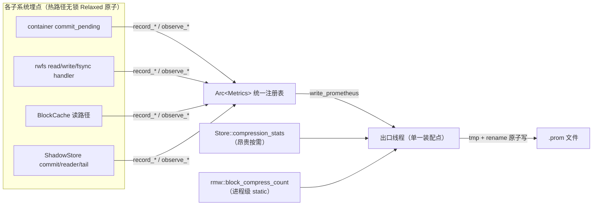

# 08 · 可观测性（指标 / Observability）

> 类型：参考（可观测性）· 状态：**部分实现**（statfs 压缩比 + sd-notify；吞吐/比值监控待扩，见 ROADMAP T4）。文档索引见 [README.md](./README.md)。

> scrollz 的运行时指标子系统：统一注册表、单一 Prometheus `.prom` 出口、扩展配方、指标目录、PromQL 示例，以及一条**解读教训**。
>
> 相关：[01-scrollz-design](01-scrollz-design.md)（架构）、[02-layered-chunking](02-layered-chunking.md)（块大小与解压缓存）。

## 1. 开关与采集

指标默认**不输出**。挂载时给 `--metrics-file <path>` 即启用：一个后台线程每 **15s** 把全部指标以 **Prometheus text 格式**原子写入该文件（写 `<path>.prom.tmp` 后 `rename`，避免采集方读到半截）。

```bash
scrollz --backend shadow --backing <dir> --mountpoint <mnt> --metrics-file /run/scrollz/m.prom
```

用 Prometheus 的 **node_exporter textfile collector**（或 grok_exporter 等）抓这个文件即可。`enable`（systemd 托管）路径经 sidecar meta 透传 `metrics_file`，守护重启后仍生效。

## 2. 指标目录

单位与命名遵 Prometheus 惯例：counter 带 `_total`、直方图单位秒带 `_seconds`、gauge 无后缀。

### 2.1 container 写批处理（双缓冲提交，见 [04-crash-safe-commit](04-crash-safe-commit.md)）

| 指标 | 类型 | 含义 |
|---|---|---|
| `scrollz_commit_ok_total` | counter | `commit_pending` 成功落 redb 的次数 |
| `scrollz_commit_failed_total` | counter | 提交失败并**合并回 active**（数据未丢、待重试）的次数 |
| `scrollz_blocks_flushed_total` | counter | 累计落 redb 的块数 |
| `scrollz_flushing_bytes_peak` | gauge | flushing 缓冲字节峰值 |

`commit_failed_total` 增长即「一次数据丢失被双缓冲避免」——**它非 0 是好事的证据，也是磁盘/后端异常的信号**。

### 2.2 FUSE per-op（前端）

| 指标 | 类型 | 含义 |
|---|---|---|
| `scrollz_fuse_read_ops_total` / `scrollz_fuse_read_bytes_total` | counter | read handler 次数 / 累计返回字节 |
| `scrollz_fuse_write_ops_total` / `scrollz_fuse_write_bytes_total` | counter | write handler 次数 / 累计写入字节 |
| `scrollz_fuse_fsync_ops_total` | counter | fsync + flush 同步操作次数 |
| `scrollz_fuse_errors_total` | counter | read/write/fsync/flush 返回错误次数 |

### 2.3 缓存命中率（两级）

| 指标 | 类型 | 含义 |
|---|---|---|
| `scrollz_blockcache_hits_total` / `_misses_total` | counter | 解压块缓存（读路径内部块免整块重解压）命中/未命中 |
| `scrollz_shadow_reader_hits_total` / `_misses_total` | counter | shadow ArchiveReader 解析缓存（免每次 get_block 重解析索引）命中/未命中 |

### 2.4 写放大 / 后端

| 指标 | 类型 | 含义 |
|---|---|---|
| `scrollz_seals_total` | counter | 尾块封块/重压落后端次数 |
| `scrollz_recompressions_total` | counter | 块级重压次数（进程级，出口按需读 `rmw::block_compress_count`） |
| `scrollz_shadow_commits_total` | counter | shadow 脏会话经 ArchiveUpdater 提交次数 |
| `scrollz_shadow_tail_appends_total` | counter | shadow 尾日志增量追加次数 |

### 2.5 延迟直方图（p50/p99）

`scrollz_read_latency_seconds`、`scrollz_write_latency_seconds`、`scrollz_fsync_latency_seconds`——各含 `_bucket{le="…"}`（累积桶，`+Inf` 恒等于 `_count`）、`_sum`（秒）、`_count`。桶：50µs–100ms + `+Inf`。计时含取锁+seal+IO 全链路，成功与失败路径都观测。

### 2.6 压缩比（昂贵按需 gauge，仅 shadow 有数据）

`scrollz_logical_bytes` / `scrollz_physical_bytes` / `scrollz_compression_ratio`——出口线程调 `Store::compression_stats()`（遍历目录树，非廉价计数）按需算。container 后端无此三项。

## 3. 架构



**要点：**

- **单一 `Arc<Metrics>` 注册表**：全 crate 共享一个实例（run_mount 建，经 `with_metrics` 注入 container store / shadow store / rwfs 前端 / TailSessions）。计数用 `Relaxed` 原子——指标是纯观测量，不参与任何 happens-before，热路径不该付内存序开销。
- **两类指标，一个出口**：廉价常驻计数/gauge 走注册表；昂贵/进程级源（`compression_stats` 目录遍历、`block_compress_count` 进程 static）由出口线程**按需读**。出口是唯一装配点，把三者合成一份 `.prom` 原子写盘。
- **扩展配方**：加一个指标 = ①加一个 `AtomicU64` 字段 → ②加一个 `record_*`/`observe_*` 方法 → ③在 `write_prometheus` 加一行 `emit`。**不改 `Store` trait、不散落改 main.rs**。想埋点的子系统拿共享 `Arc<Metrics>` 即可。该配方已被 6 次实践验证（container / per-op / blockcache / seal / shadow / 直方图）。
- **锁纪律**：埋点是 lock-free 原子，但仍一律落在 per-inode 写锁作用域**之外**（含 fsync/flush 的 seal 早返回路径显式 `drop(guard)` 后观测），绝不违反 shadow/rwfs 的死锁与 `invalidate_reader<up.sync` durability 不变量（每次改动都过 `concurrency_deadlock` + `fault_injection` 回归）。
- **零第三方依赖**：手写 Prometheus text（含正确的累积直方图），对齐项目极简依赖哲学。

## 4. PromQL 示例

```promql
# read p99 延迟（秒）
histogram_quantile(0.99, rate(scrollz_read_latency_seconds_bucket[5m]))

# 解压块缓存命中率
rate(scrollz_blockcache_hits_total[5m])
  / (rate(scrollz_blockcache_hits_total[5m]) + rate(scrollz_blockcache_misses_total[5m]))

# 写吞吐（MiB/s）
rate(scrollz_fuse_write_bytes_total[5m]) / 1048576

# 提交失败率（应恒 0；非 0 = 后端异常，双缓冲正在兜底）
rate(scrollz_commit_failed_total[5m])
```

## 5. 解读教训（务必先证伪再告警）

**事件**：全景 `.prom` 里 `scrollz_blockcache_hits_total 0`（整文件重读、命中为零）。第一反应告警「解压块缓存没起效，值得查」。

**真相**：那次测试用了 `--chunk-size 4096`。BlockCache 的作用是**消除解压放大**——只有当 `chunk_size > 内核读粒度(~128KiB)` 时，一个大压缩块才会被多个小内核读**重复覆盖**，缓存才有可命中的重复。chunk=4KiB 时一个 128KiB 内核读跨 32 个块、每块只读一次，**天然没有可命中的重复**，0 命中是**正确**的。换 1MiB 大块同负载实测 **13 hits / 11 misses**，缓存正常工作。

**教训（写进流程）：**

1. **指标暴露的数，先对 ground truth 证伪，再告警**。异常读数往往是「配置/负载不符合该指标的前提」，不是 bug。判据是「这个指标在当前配置下**本应**是多少」，而非「它看起来不对」。
2. **缓存类指标要连同触发条件一起看**：blockcache 命中依赖 `chunk_size > 128KiB`（否则无放大可消除）；reader 缓存命中依赖同 inode 被多次 `get_block`。命中为零可能只是「此负载下无重复」。
3. 一次「用指标证明了不是 bug」和「用指标发现 bug」同样有价值——前者以证据排除了误报。

> 附带真信号（非 bug，未修）：`release`（close）无条件失效 block_cache，即使只读 close；只读 open 走 `FOPEN_KEEP_CACHE`、内核页缓存承接跨 open 重读，故 block_cache 跨 open 增量价值有限。可选优化：release 时按 `flags.acc_mode()==O_RDONLY` 跳过失效。

## 6. 已知后续

- **读放大根治**：当前 FUSE 单读封顶 128KiB（init 只协商 `max_write`），故 1MiB 块被 ~8 个内核读覆盖、靠 block_cache 兜。协商 `max_read`/`readahead` 使单读覆盖整块可**从源头消除**重解压（届时 block_cache 降为纯随机读优化）。风险较高（FUSE init 调参、平台上限），未做。
- **`blksize` 广告**：已从误导的 4KiB 改为广告文件块大小（封顶 1MiB），使 honor `st_blksize` 的工具按块读而非 4K 读（见 [提交 867ed81]）。与 `max_read` 协商配合才完全兑现。
- **散落计数统一**：`block_compress_count`（bench 用）仍留 rmw 进程级 static、由出口读；`seal_count` 已迁进注册表（`seal_count()` 委托 `Metrics::seals()`，API 不变）。
